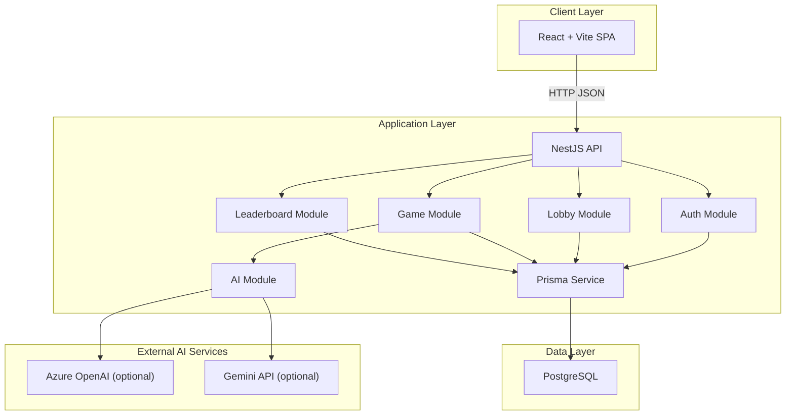
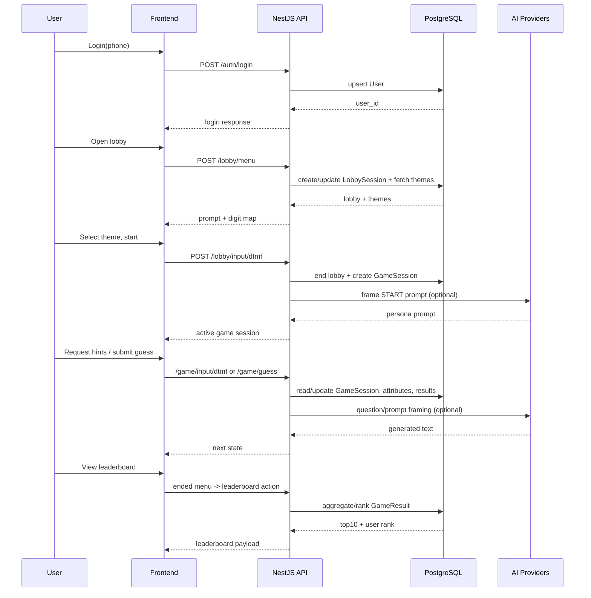
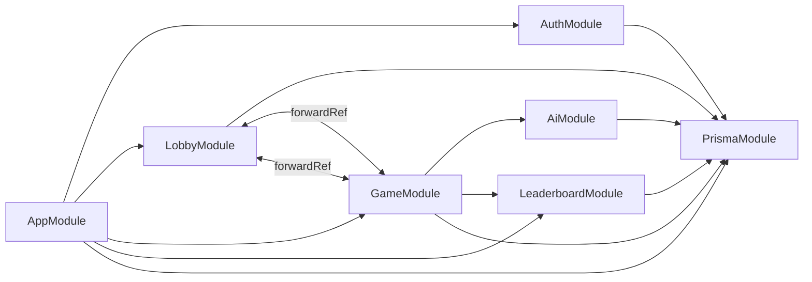

# Architecture Diagram

## 1. Deployment/Infrastructure View

## 2. Component Interaction View (Main Gameplay)

## 3. Backend Package Dependencies

## 4. Operational Notes
- Backend exposes REST on `PORT` (default `3000`).
- Frontend uses `VITE_API_URL` fallback `http://localhost:3000`.
- Database dependency provided via Docker Compose (`postgres:16`).
- AI service calls are optional and fail-safe to deterministic fallback text.

