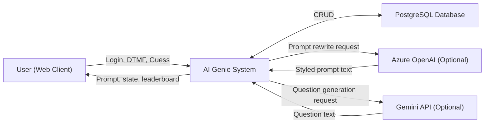
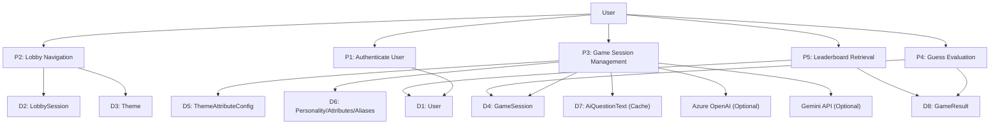

# Data Flow Diagram (DFD)

## Level 0 (Context Diagram)

```mermaid
flowchart LR
  U["User (Web Client)"] -->|Login, DTMF, Guess| S["AI Genie System"]
  S -->|Prompt, state, leaderboard| U
  S <-->|CRUD| DB["PostgreSQL Database"]
  S -->|Prompt rewrite request| AZ["Azure OpenAI (Optional)"]
  S -->|Question generation request| GM["Gemini API (Optional)"]
  AZ -->|Styled prompt text| S
  GM -->|Question text| S
```

## Level 1 (Major Processes)

```mermaid
flowchart TB
  U["User"] --> P1["P1: Authenticate User"]
  U --> P2["P2: Lobby Navigation"]
  U --> P3["P3: Game Session Management"]
  U --> P4["P4: Guess Evaluation"]
  U --> P5["P5: Leaderboard Retrieval"]

  P1 --> D1["D1: User"]
  P2 --> D2["D2: LobbySession"]
  P2 --> D3["D3: Theme"]
  P3 --> D4["D4: GameSession"]
  P3 --> D5["D5: ThemeAttributeConfig"]
  P3 --> D6["D6: Personality/Attributes/Aliases"]
  P3 --> D7["D7: AiQuestionText (Cache)"]
  P4 --> D4
  P4 --> D8["D8: GameResult"]
  P5 --> D8
  P5 --> D1

  P3 --> E1["Azure OpenAI (Optional)"]
  P3 --> E2["Gemini API (Optional)"]
```

## Level 2 (Game Interaction Path)

```mermaid
flowchart LR
  U["User Input"] --> G1["/game/start"]
  G1 --> GS["Create ACTIVE GameSession"]

  GS --> G2["DTMF: QUESTION_SET"]
  G2 -->|1| G3["Generate Hint Option Set"]
  G2 -->|2| G4["Switch to GUESS_INPUT"]
  G2 -->|9| GE["End: ENDED_EXIT"]

  G3 --> G5["DTMF: HINT_SELECTION"]
  G5 --> G6["Fetch Attribute Value for Hidden Personality"]
  G6 --> G7["Append QA History + Increment Hint Counter"]
  G7 -->|Hints remain| G2
  G7 -->|Hints exhausted| G4

  G4 --> G8["/game/guess (Text)"]
  G8 --> G9["Fuzzy Match + Candidate"]
  G9 -->|Exact| G10["Evaluate Correctness"]
  G9 -->|Near| G11["GUESS_CONFIRM"]
  G9 -->|Low score| G12["Wrong Guess Flow"]

  G11 -->|1| G10
  G11 -->|2| G4

  G10 -->|Correct| GW["End: WON + Persist GameResult"]
  G10 -->|Incorrect| G12
  G12 -->|Guesses left| G2
  G12 -->|No guesses left| GL["End: FAILED_GUESSES + Persist GameResult"]
```

