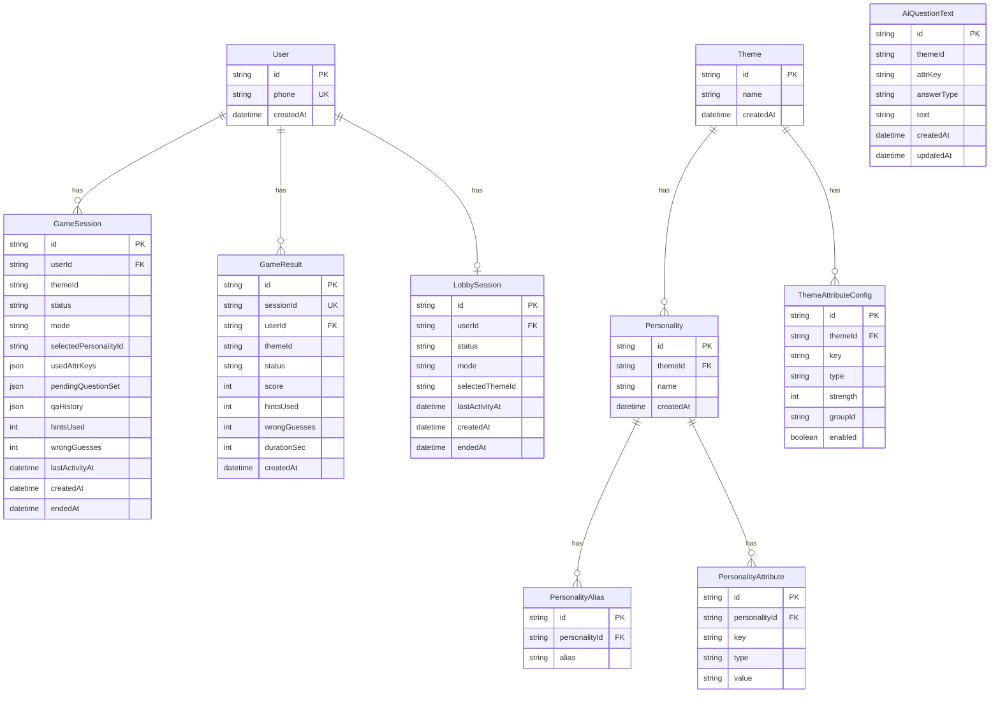

# Database Design Document (ERD/Schema)

## 1. Database Technology
- Engine: PostgreSQL
- ORM: Prisma
- Source schema: `/Users/jangalaramsaichaitanya/ai-genie/backend/prisma/schema.prisma`

## 2. ER Diagram

## 3. Tables and Constraints

### 3.1 `User`
- Primary key: `id`
- Unique: `phone`

### 3.2 `Theme`
- Primary key: `id` (string, seeded/static style IDs)

### 3.3 `Personality`
- FK: `themeId -> Theme.id`

### 3.4 `PersonalityAlias`
- FK: `personalityId -> Personality.id`
- Index: `personalityId`

### 3.5 `PersonalityAttribute`
- FK: `personalityId -> Personality.id`
- Unique: `(personalityId, key)` (one value per key for a personality)
- Index: `key`

### 3.6 `ThemeAttributeConfig`
- FK: `themeId -> Theme.id`
- Unique: `(themeId, key)`
- Index: `themeId`

### 3.7 `GameSession`
- FK: `userId -> User.id`
- Index: `(userId, status)`
- JSON state columns:
- `usedAttrKeys`, `disabledGroupIds`, `pendingQuestionSet`, `qaHistory`

### 3.8 `LobbySession`
- FK: `userId -> User.id`
- Unique: `userId` (single lobby session row per user)
- Index: `(userId, status)`

### 3.9 `GameResult`
- FK: `userId -> User.id`
- Unique: `sessionId` (one result per game session)
- Indexes:
- `(themeId, score)`
- `score`
- `(userId, createdAt)`

### 3.10 `AiQuestionText`
- Unique: `(themeId, attrKey, answerType)`
- Index: `themeId`

## 4. Data Integrity Rules
- User phone numbers are globally unique.
- A personality cannot have duplicate attribute keys.
- A theme cannot have duplicate attribute-config keys.
- A game session can produce at most one game result.
- AI question cache ensures deterministic reuse for same attribute tuple.

## 5. Query and Index Considerations
- Leaderboard query aggregates by `themeId` and ranks by `score/wins/losses`; supporting index `(themeId, score)` exists.
- Active session lookup pattern uses `userId + status`; indexed on `GameSession` and `LobbySession`.
- Attribute retrieval path uses `(personalityId, key)` unique lookup for hint response.
